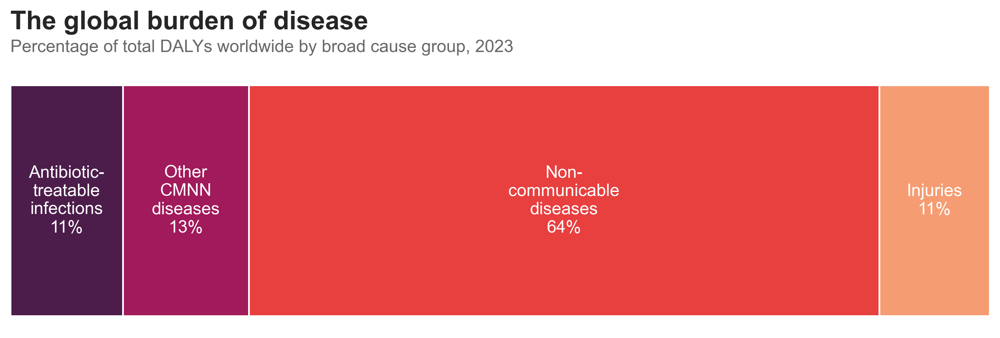
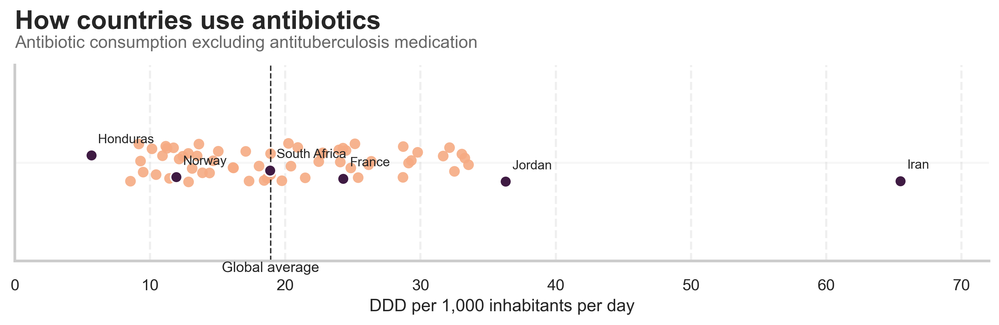

Antibiotics quietly hold up a big part of modern medicine: they keep pneumonia survivable, make C-sections routine, and stop a scratch from becoming sepsis. But the same drugs are now under growing strain. Resistance is spreading faster than new treatments arrive, and the places that rely on antibiotics most are often those least equipped to handle resistant infections.

When we speak about the global burden of disease we group causes into four broad classes. **Non-communicable diseases** such as heart disease, stroke and cancer which accounts for about two-thirds of life lost. The remaining third is shared between **antibiotic-treatable infections** such as pneumonia, tuberculosis, neonatal sepsis and many bloodstream infections, **other communicable, maternal, neonatal and nutritional (CMNN) diseases**, and **injuries**. 

  Life lost refers to disability-adjusted life years (DALYs), a measure of the years of healthy life lost to illness, disability, and early death combined.

Antibiotic-treatable infections make up around **one in nine** years of healthy life lost worldwide. That is smaller than it was a few decades ago, but it is still a large slice of global ill-health. If we zoom out to the last three decades, the first story we see is one of progress. Life loss from diarrhoeal diseases and lower respiratory infections have fallen sharply since 1990. Drug-susceptible tuberculosis has also declined. Vaccination, safer water and sanitation, better nutrition – and a lot of effective antibiotic courses – all contributed to that downward trend.

 

But not every curve bends down. While drug-susceptible TB is falling, **multidrug-resistant TB** is not. Urinary tract infections and related kidney infections are slowly nudging upward. Antimicrobial Resistance (AMR) occurs when bacteria, viruses, fungi and parasites no longer respond to antimicrobial medicines. As a result of drug resistance, antibiotics and other antimicrobial medicines become ineffective and infections become difficult or impossible to treat, increasing the risk of disease spread, severe illness, disability and death. 

Bacterial AMR is often framed as a problem of intensive-care units in wealthy countries. The burden data tell a different story. When we look at life loss directly attributable to bacterial resistance, **Sub-Saharan Africa** and **South Asia** sit far above the global average.

 

In these regions, resistant infections collide with late presentation, limited laboratory capacity and patchy access to second-line drugs. A bloodstream infection that might mean a long hospital stay in a high-income country can still be a death sentence. For companies working on alternatives such as phage therapy, this geography matters: the burden is not evenly shared, and neither is the capacity to respond.

  Phage therapy uses viruses that specifically infect and kill bacteria as targeted “living antibiotics” to treat bacterial infections, including those that are drug-resistant.

Resistance does not appear from nowhere. It is shaped by how often, and how broadly, antibiotics are used. One way to see this is to look at **defined daily doses (DDD) per 1,000 inhabitants per day** – roughly, how many people out of 1,000 are on antibiotics on any given day.

The global average is around **18 DDD per 1,000 people per day**. Countries cluster around that middle band, but there is striking variation. Citizens in **Iran**, for example, take roughly three times that average, while those in **Honduras** use about half.

Interpreting these differences is not straightforward. Low use might reflect careful prescribing and good infection prevention, or it might mean people never reach care or cannot afford treatment. High use might signal good access, or it might indicate over-the-counter sales and unnecessary prescriptions. What the chart does show clearly is that the **selective pressure for resistance**, the evolutionary push we give bacteria, is very uneven across the world.

To understand how “healthy” a country’s antibiotic use really is, we also need to look at **which** drugs are being used. This is where the WHO **AWaRe** classification comes in.[1] It divides antibiotics into three groups:

- **Access**: first-line, usually narrower-spectrum antibiotics that should be widely available
- **Watch**: broader-spectrum agents with higher resistance potential
- **Reserve**: last-line drugs that we want to save for the toughest infections

WHO recommends that at least **70%** of a country’s total antibiotic consumption should come from Access drugs, with the remainder made up of Watch and Reserve.[2] In the chart below, the horizontal axis shows the **share of DDDs that are Access drugs**; the vertical axis shows the **share that are Watch and Reserve**.

 

The green area marks countries where Access drugs make up at least 70% of use, broadly in line with stewardship goals. Countries like **Buthan, South Africa and France** sit here: when people receive antibiotics, they are usually getting the simpler, more conservative options. In the red area are countries where the share of Watch and Reserve antibiotics is higher than 30%. Even if total volumes were modest, this mix would still be worrying: it “burns through” last-line options faster and leaves fewer fallback choices when resistance emerges.

**Why this matters for the next generation of antimicrobials**

These visuals show a narrowing room for error. Antibiotics still underpin a large share of global health, and they have delivered huge gains over time. But in the regions with the highest infectious burden, resistance already costs the most lives. Some countries are exposed to very high levels of antibiotic pressure, and many lean heavily on drugs that they should rather save.

New approaches, such as phage therapy, will slot into this landscape, not replace it wholesale. Their value will be greatest where they can do three things at once: rescue patients with resistant infections today, slow the consumption of last-line antibiotics, and make it easier to extend effective treatment to places that currently lack it.

---

### References

[1] WHO, *AWaRe classification of antibiotics for evaluation and monitoring of use*, 2023.  
[2] WHO, AWaRe stewardship target: at least 60–70% of national antibiotic consumption from Access group antibiotics.  
[3] Global Burden of Disease Study (GBD) 2023, IHME – DALYs by cause and age.  
[4] Murray et al., *Global burden of bacterial antimicrobial resistance in 2019*, The Lancet, 2022.  
[5] WHO GLASS Antimicrobial Use database – DDD per 1,000 inhabitants per day by country.
