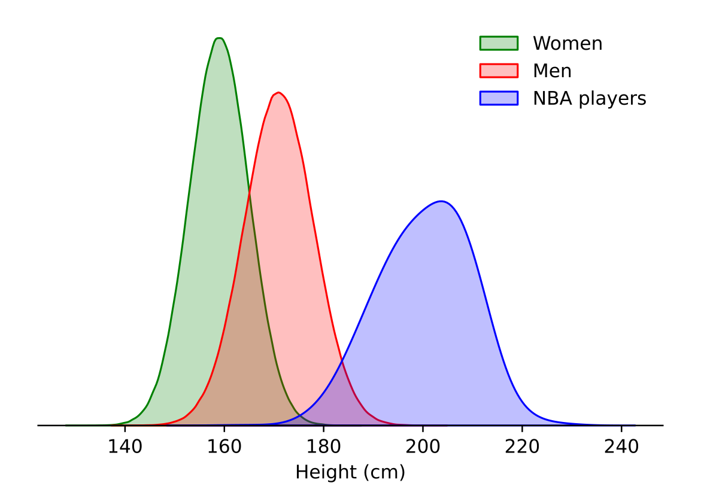

It’s difficult to appreciate the height of NBA players on television, especially when you’re comparing apples with apples, i.e., a homogenous group of basketball players on the court. The graph below compares apples with oranges, or more accurately bananas with strawberries, or more simply NBA players with the human population.

Above are the distributions of height in centimeters across:

* Adult women globally
* Adult men globally
* NBA players (a specific subset of adult men)

The adult women distribution was created as a normal distribution with a mean of 159 cm[^1] and a standard deviation of 6 cm.

The adult men distribution was created as a normal distribution with a mean of 171 cm[^1] and a standard deviation of 7 cm.

The NBA players distribution was created as a kernel density estimate using data on approximately 2300 players who have been part of an NBA team roster between 1996 and 2019.[^2]

This type of plot can be seen as a smoothed histogram where the height of the curve gives us an idea of how frequent a certain value will be in the population.

The fact that the peak of the distribution of height for women is ‘higher’ than the one of men’s means that we can expect to find a greater proportion of women at this mean height than we would find men at their mean height.

Plotting the NBA players’ height distribution on the same graph is, I think, a good reminder that outliers, however rare, do exist. If you only looked at the men’s height distribution you could think that the curve hits zero somewhere between 200 and 220 cm and that no human will ever be taller. Looking at the NBA players population, a subset of the global adult men population, you realize that such people do exist.

In fact the shortest and tallest adult heights ever recorded were respectively 54.6 cm and 272 cm.[^3] Wayyy out of the chart.

Actually, still assuming height across adults is normally distributed[^4] you can apply the following rules:

* 68% of heights will fall within one standard deviation of the mean height
* 95% within two standard deviations
* 99.7% within three standard deviations

If you want to read more about human height, its evolution across the world and predictions for the future I encourage you to check out this great [article from Our World in Data](https://ourworldindata.org/human-height).

Final thought, if your dream is to play in the NBA but your height is below average, don’t let that be the excuse to not pursue your dream. Standing at 160 cm, Muggsy Bogues played 14 seasons in the NBA as well for the USA national team during the 1986 FIBA World Championship, which they won.

2.21 m Arvydas Sabonis? No problem.

[^1]: Adult men and women global height [dataset](https://www.ncdrisc.org/data-downloads-height.html)
[^2]: NBA players [dataset](https://www.kaggle.com/justinas/nba-players-data)
[^3]: [https://en.wikipedia.org/wiki/Human_height](https://en.wikipedia.org/wiki/Human_height)
[^4]: A fun article challenging the assumption that the height of human beings follows a normal distribution: [When will we see people of negative height?](https://rss.onlinelibrary.wiley.com/doi/full/10.1111/j.1740-9713.2013.00642.x)