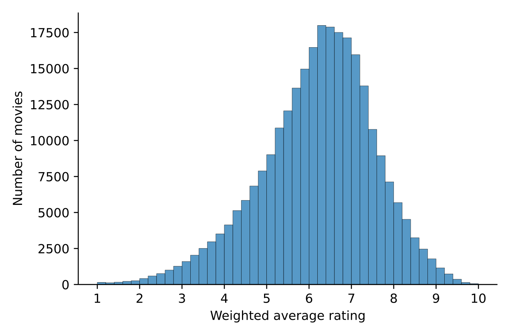
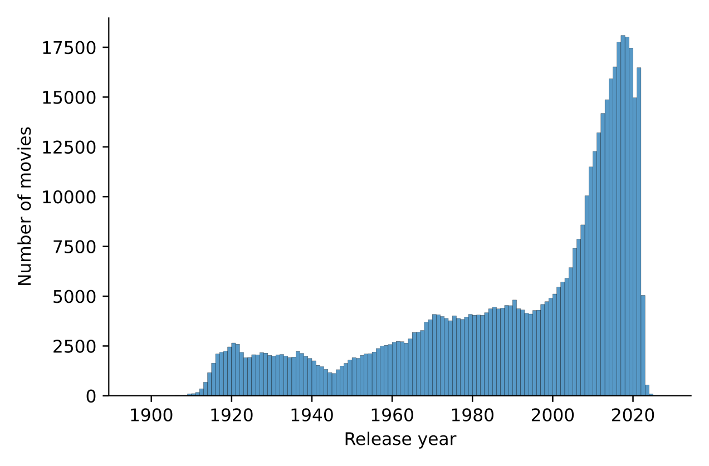

I love watching movies but I hardly watch a movie per month. Partly because I feel like the less I watch the more I will enjoy watching any single one of them (law of diminishing returns?). Partly because I’m busy plotting distributions.

Anyway, since I watch so few movies and since there are so many to watch (in the USA alone, 700 English-language films are released on average every year[1](#notes)) I like to be sure that what I’m going to spend the next hour and a half watching is going to be worth it. One of the ways I sometimes do that is by checking the weighted average ratings[2](#notes) on [IMDb.com](https://www.imdb.com/).

But what actually constitutes a _good_ rating? Well, in my opinion this depends on all the other ratings!

Indeed, if I just told you that a movie is rated 6.3 out of 10 you could think “That sounds like a decent movie!” What if I told you that half of the movies on IMDb have a better score than that? Would you still be confident that you’re going to enjoy this movie?

This is where a distribution comes in handy.

This histogram shows the number of movies in bins (or buckets) of .2 points. For example you can see that about 17 500 movies have a weighted average score between 6.2 and 6.4. A similar number of movies fall in the bin just above, 6.4 to 6.6.

As pointed out, the median weighted average score on IMDb is 6.3. Half of the movies have a score above that, and half have a score below.

Here is the number of movies with a weighted average rating…  
…above 6 - 163 754 - 60.3%  
…above 7 - 76 792 - 28.3%  
…above 8 - 20 212 - 7.4%  
…above 9 - 2 498 - 0.9%

Note that I’m only considering movies for which IMDb provides an average rating. A looot of movies do not have an average rating on IMDb (more than half of them). The reason is that a movie needs at least 5 individual ratings before IMDb displays its average rating.

If you feel like 5 votes is not enough to give an accurate picture, here are the numbers if we restrict ourselves to movies that have received at least 1 000 votes:  
Rating above 6 - 24 851 - 68.7%  
Rating above 7 - 11 829 - 32.7%  
Rating above 8 - 1 719 - 4.8%  
Rating above 9 - 52 - 0.1%

* * *

Throwing in another distribution while we’re here. Here is the number of movies per release year.

You may have noticed that the graph does not stop in 2021. That’s because IMDb also contains a few movies that have not been released yet like Avatar 2, but also Avatar 3, but also Avatar 4, but also Avatar 5… Fortunately people cannot rate these movies yet.

It’s probably a good thing that IMDb keeps a certain control on the scores displayed… and maybe they should extend this control.

The short film [Bois de Boulogne](https://www.imdb.com/title/tt0000046/) from 1896 was given an average rating of 4.1 based on the votes of 32 IMDb users. Sadly, this film is considered lost as no copy of it is known to exist.

[Georges Méliès](https://en.wikipedia.org/wiki/Georges_M%C3%A9li%C3%A8s) is watching you, trolls.

While looking for data to write this article I came across the [IMDb Top 250 Movies](https://www.imdb.com/chart/top/?ref_=nv_mv_250). In order to have a legitimate ranking, IMDb only takes into account the votes of regular voters to produce this list. And they do not disclose the criteria used to count someone as a regular voter...

Maybe I’ll start with these next time I want to watch a movie ;)

  

* * *

**Notes and data sources**

1.  [↑](#cite-ref-1 "Jump up")[http://data.uis.unesco.org](http://data.uis.unesco.org)
2.  [↑](#cite-ref-2 "Jump up")"IMDb publishes weighted vote averages rather than raw data averages. The simplest way to explain it is that although we accept and consider all votes received by users, not all votes have the same impact (or 'weight') on the final rating." [IMDb Ratings FAQ](https://help.imdb.com/article/imdb/track-movies-tv/ratings-faq/G67Y87TFYYP6TWAV#)
3.  [IMDb Datasets](https://datasets.imdbws.com/)
