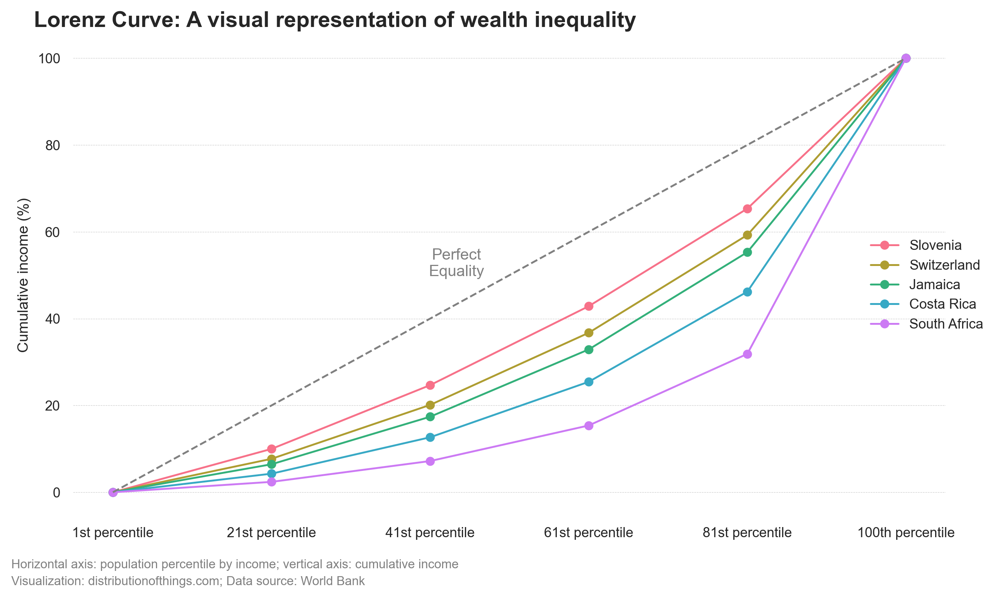
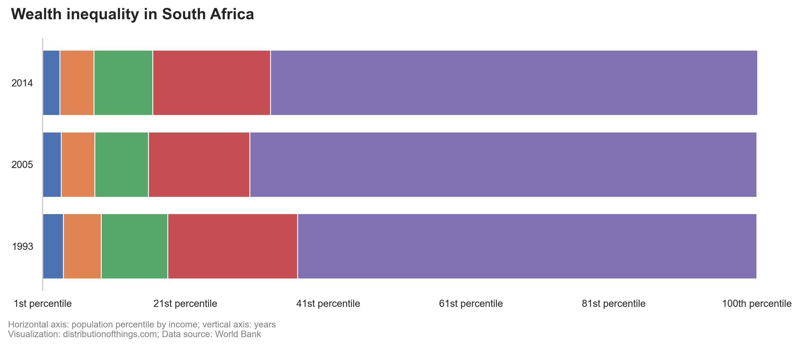

You've probably heard of the term "Gini coefficient" as a benchmark for measuring a country's wealth inequality. It’s a number between 0 and 1, where higher values indicate greater inequality. South Africa has the highest Gini coefficient (0.57), while Slovenia boasts the lowest (0.22). While the Gini coefficient is useful for quick comparisons, it doesn't provide a detailed picture of where the wealth lies.

The Gini coefficient is calculated based on something called the Lorenz Curve. This curve offers a more detailed visualization of inequality. It compares the actual distribution of income or wealth to a hypothetical line of perfect equality (a 45° line where everyone has the same share of income).

Here’s how it works:

-   The x-axis represents the population, sorted by income from poorest to richest.

-   The y-axis represents the cumulative share of income.

-   The more the Lorenz Curve sags below the line of perfect equality, the greater the inequality.

The Gini coefficient itself is calculated as the ratio of two areas: the area between the line of perfect equality and the Lorenz Curve, and the total area under the line of perfect equality. The higher the coefficient, the more unequal the distribution.

South Africa's Lorenz Curve is highly skewed, meaning the richest 20% hold a disproportionate share of the country’s wealth. This isn’t surprising given the country’s history. Inequality in South Africa is rooted in decades of colonialism and racial segregation during apartheid, which only ended in 1994. Despite this, wealth has not been redistributed. Instead, the wealthiest 20% of South Africans continue to accumulate a larger and larger share of the nation’s income.

------------------------------------------------------------------------

Sources:

[1] [World Inequality Database (WID)](https://wid.world) (retrieved on: 2024-01-06)
