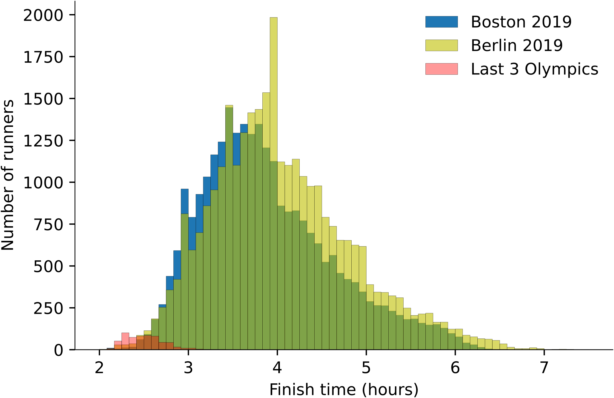

How long does it take to run a marathon (42.195 km)? Well, that depends partly on where the marathon takes place, on the weather conditions that day, but mostly on who’s running the marathon. Well-known marathons such as the Boston and Berlin marathons welcome a myriad of athletes. Amateurs looking to tick a marathon off their bucket list and pros who set world records. Comparatively, it’s not so easy to get your hands on an entry ticket to the Olympic marathon.

Here are the distributions of finish times for the following races:

* 2019 Boston marathon
* 2019 Berlin marathon
* London 2012, Rio 2016 and Tokyo 2020 Olympics women and men’s marathons grouped together[^1]

The three distributions overlap and each one is represented by a different semi-transparent color as indicated by the legend. The dark green is where the Boston 2019 and the Berlin 2019 distributions overlap.

Each bar represents the number of people finishing within a 5-minute window. We can see for instance that close to 2000 runners finished the Berlin marathon with a time between 3 hours 55 minutes and 4 hours. Must have been busy at the finish line![^2]

While we’re talking about this peculiar peak, notice how it’s actually… not so peculiar. There are similar spikes in both the Berlin and Boston marathon distributions just before the 3 hours and the 3 hours 30 minutes mark. These are symbolic times that many runners aim for, and many succeed!

Similarly, you can see important drops at the 4 hours and 30 minutes and 5 hours mark, suggesting people also rush to arrive just before these times.

Now if we zoom in on the super fast runners (bottom left of the chart) it might be surprising at first to see such an overlap between the olympic marathons finish times and finish times of marathons open to the general public. Maybe some of your friends or relatives often take part in these races? Well, if your rusty Uncle Edgar cannot compete at the Olympics, know that the best marathon runners can and will definitely “join” him in running in Boston next year because… that’s their job!

Here is how much you can earn if you run fast, very fast:

* Boston 2019: $150,000 for the first male and female finisher, plus a $50,000 bonus for breaking the record.
* Berlin 2019: €40,000 for the first male and female finisher, plus a €30,000 bonus for breaking the record.
* The International Olympic Committee does not pay prize money to medalists. However, many countries offer monetary rewards to their athletes.[^3] For example, in Kenya, gold medallists are guaranteed one million Kenyan shillings ($9,000 at the time of writing).[^4]

Note that the second, third, fourth and so on (up to the tenth in the case of Boston at least) also get a reward. I did not show them to keep it simple.

[^1]: There are around 100 athletes for every olympic marathon race vs tens of thousands for big marathons like Boston or Berlin. I chose to aggregate the results of the last three olympics in order to have enough data to show on the chart, while keeping the relative proportions to get a sense of how few people run this race compared to a city marathon.
[^2]: We’re actually looking at _net times_ (time elapsed between crossing the start line and the finish line), not _gun times_ (time elapsed since the official start of the race). These times differ because participants start in waves. So these ~2,000 people did not all cross the line within that 5-minute window (since they did not all start at the same time). I imagine one of the many challenges of the race organisation is to avoid traffic jams during the race by carefully designing start waves.
[^3]: [https://www.cnbc.com/2021/07/29/tokyo-olympics-how-much-athletes-earn.html](https://www.cnbc.com/2021/07/29/tokyo-olympics-how-much-athletes-earn.html)
[^4]: [https://allafrica.com/stories/202108190387.html](https://allafrica.com/stories/202108190387.html)