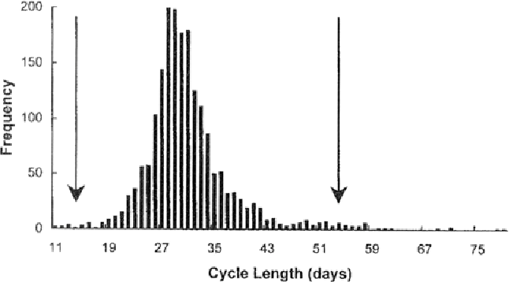
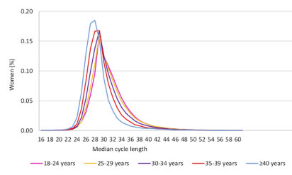
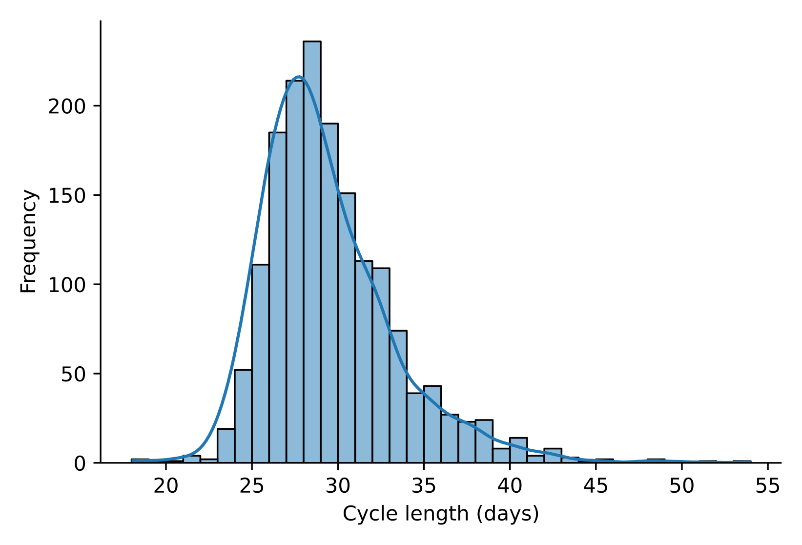

When we think of a menstrual cycle we often think of a 28-day cycle, with menstruation starting at day one and ovulation taking place like clockwork at day fourteen. This assumption is met with a handful of euphemisms, such as "time of the month" corresponding with the Gregorian calendar or "lunar cycle" as it is equivalent to approximately one lunar month.[^1]

I read that, on any given day, 800 million women around the world are menstruating, and that the average woman will menstruate once a month, for roughly 35 to 40 years of her life. That’s approximately 3000 days—more than 8 years—of periods during her lifetime.[^2]

Those stats got me wondering: is the average menstrual cycle really 28 days and how are menstrual cycles distributed around the mean?

I first looked at previous studies that analysed the length of menstrual cycles, and indeed the studies showed that the average menstrual cycle is approximately 28 days. You might notice, however, that the distribution is not bell curved, rather it has a long tail to the right.

  

©Zhengwei Yang, Jeffrey C. Schank. Originally published in Human Nature ([source](https://www.semanticscholar.org/paper/Women-do-not-synchronize-their-menstrual-cycles-Yang-Schank/882fe2679be7059f12c6497a0bbf380b929b04be))

©Jessica A Grieger, Robert J Norman. Originally published in the Journal of Medical Internet Research ([source](https://europepmc.org/article/pmc/pmc7381001))

Using a publicly available anonymised dataset[^3] I plotted the distribution myself and similarly found that while the average cycle length is 28 days, the distribution is skewed to the right, with some cycles lasting as long as 55 days. In fact, "the duration of menstrual cycles of women can vary from as short as 14 days to as long as 360 days!”[^4]

This distribution highlights variations in menstrual cycle characteristics that are not widely known yet have significant implications for health and well-being.

For example, considering that women use their menstrual cycles to plan and avoid pregnancy, a misunderstanding of one’s own cycle could have unwelcome consequences, such as failing to fall pregnant or falling pregnant unintentionally.

Women might also consider their menstrual cycle ‘not normal’ when it does not follow the average length of 28 days, leading to anxiety, confusion or shame.[^5]

This is an example where assuming the mean/median is the norm can do more harm than good.

[^1]: Although the average length of the human menstrual cycle is similar to that of the lunar cycle (29.5 days), there is no causal relation between the two.
[^2]: [https://www.wateraid.org/us/stories/International-womens-day-having-a-period-shouldnt-hold-women-back](https://www.wateraid.org/us/stories/International-womens-day-having-a-period-shouldnt-hold-women-back)
[^3]: [https://epublications.marquette.edu/data_nfp/7/](https://epublications.marquette.edu/data_nfp/7/)
[^4]: [Norris & Carr 2013, p. 361](https://books.google.com/books?id=F_NaW1ZcSSAC&pg=PA361)
[^5]: If you search for "menstrual cycle length", Google will suggest some frequently asked questions. Many follow the same pattern: "Is a \[insert any number here\] day cycle normal?"