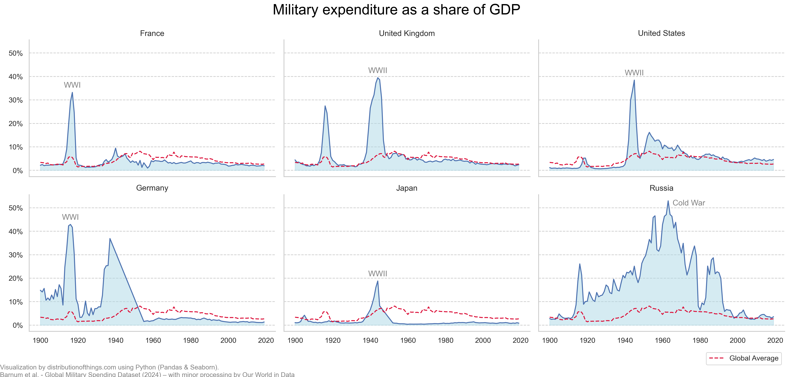
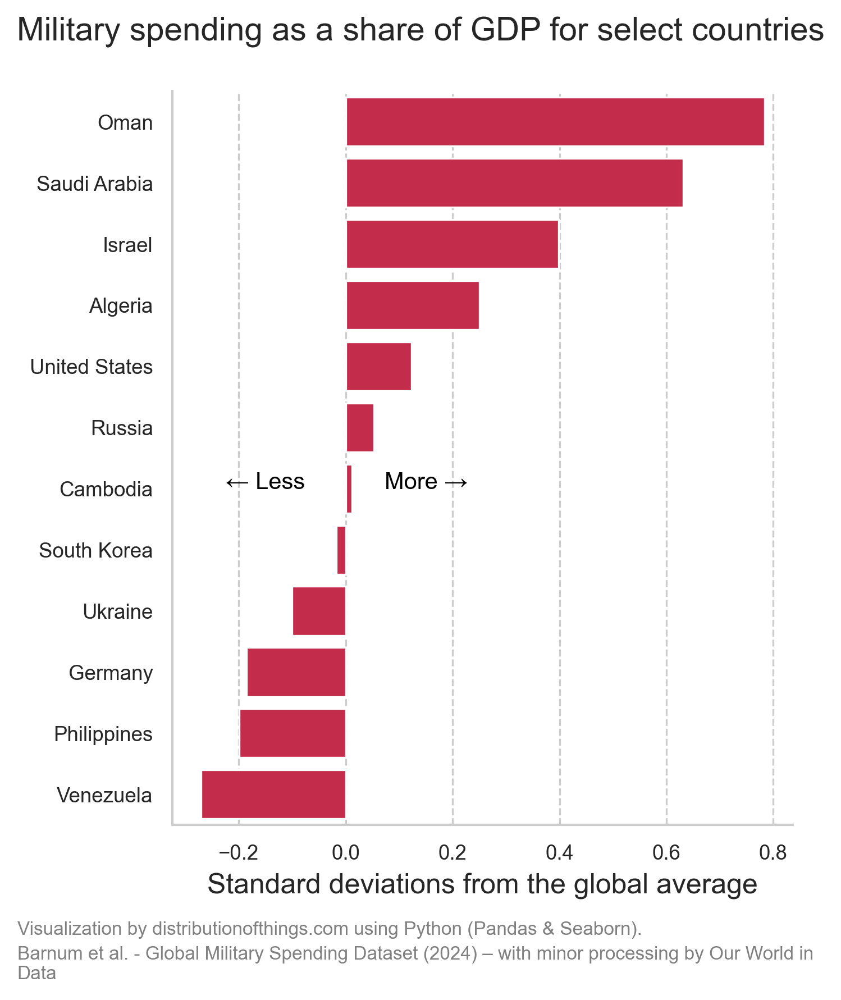

### The cost of war for a nation

The first figure provides a historical look at how major global wars have caused spikes in military spending as a share of Gross Domestic Product (GDP). In this chart, military spending is shown in relation to the global average.

During the 20th century, the World Wars stand out clearly. France and Germany hit their military spending peaks during World War I, with 33% and 42% of their respective GDP going towards the war effort. In World War II, the United Kingdom, United States, and Japan reached their highest levels of military spending, committing 39%, 38%, and 18% of GDP to defence.

While Russia was involved in both World Wars, its peak military spending occurred during the Cold War in the 1960s, where spending surged before tapering off slowly in the following decades.

Overall, military spending as a percentage of GDP has steadily declined for these nations, moving closer to the global average, indicating a shift toward lower defence budgets as these economies grew post-war.

### Comparing military spending across countries: More or less?

In the second figure, we look at military spending deviations from the global average (measured from 2009 to 2019). The global average is 3%, and the chart shows how different countries compare to that benchmark.

Oman, Saudi Arabia, and Israel lead the way with spending far beyond the global average, reflecting a much higher focus on military resources. On the other side of the spectrum, countries like Venezuela, Germany, and the Philippines spend far less, falling below the global average. The standard deviation provides a useful way to gauge how much more or less countries spend compared to the global norm, highlighting the vast differences in national defence priorities.
