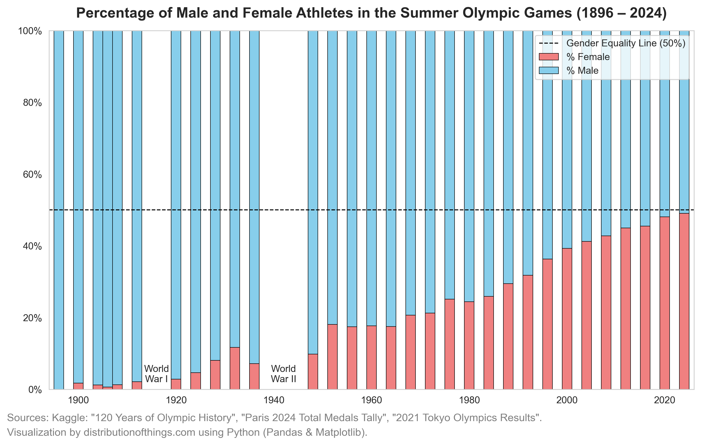

Early Olympics featured a relatively small selection of traditional sports like athletics, wrestling, and cycling. Over time, new sports such as badminton, triathlon, BMX cycling, and skateboarding were introduced, reflecting changing global interests and athletic innovations.

The inclusion of extreme sports like surfing, sport climbing, and skateboarding marks a stark contrast to some of the more traditional—and in some cases, now obsolete—events like art competitions, which were part of the Olympic program between 1912 and 1948. These early events celebrated fine arts like painting, sculpture, architecture, and literature, reflecting the Olympic movement's initial aspiration to combine physical prowess with artistic achievement.

.png)

The first modern Olympics in 1896 excluded female athletes entirely. Over time, women have increasingly become part of the Games. By the Tokyo 2020 Olympics and leading into the Paris 2024 Games, female participation approached near parity with male athletes.

While the overall participation of women has increased, the availability of sports for both genders has been uneven. Certain sports like athletics, swimming, and gymnastics have long been accessible to both genders, while others like boxing, weightlifting, and wrestling saw much later inclusion for female athletes. Some sports, such as synchronized swimming and rhythmic gymnastics, remain female-only.

.png)

 This uneven representation highlights the historical barriers women faced in accessing specific sporting events, as well as how far we’ve come in promoting equality in athletic competition.