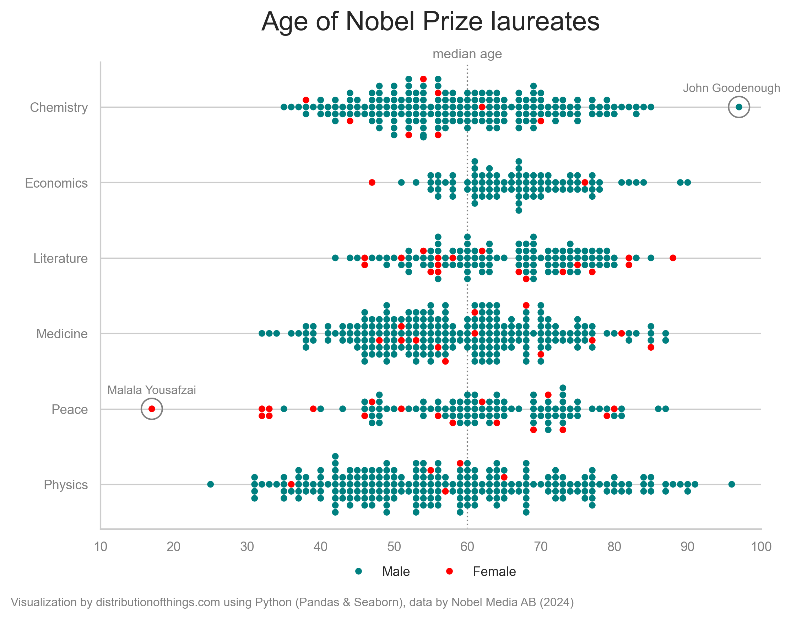
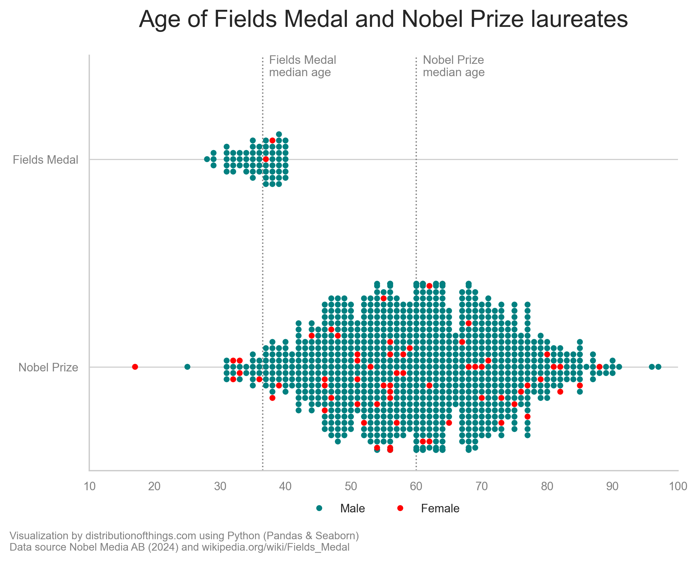

This **swarmplot** visualizes the **age distribution** of Nobel Prize laureates across various categories, with a focus on gender representation. The median age of **60** suggests that Nobel recognition typically comes after a lifetime of achievements.

The youngest laureate, **Malala Yousafzai**, who won the Nobel Peace Prize at the age of 17, is a significant outlier. On the opposite end, **John Goodenough**, awarded the Nobel Prize in Chemistry at the age of 97 (indeed, he was finally deemed "good enough"!), represents the upper boundary of laureate ages.

The **low representation of female laureates** is striking, with notable variations between categories. Fields like **Literature** (15%) and **Peace** (17%) have relatively higher percentages of female laureates compared to STEM fields like **Physics**, **Chemistry**, and **Economics**, which all show less than **5%** female representation. This pattern reflects a broader societal trend where women are more frequently recognized in fields traditionally perceived as "soft sciences" or areas with a cultural or humanitarian focus.

Although the **Nobel Prize** does not have a category for mathematics, the equally prestigious **Fields Medal** serves to honor mathematicians, typically those early in their careers, as it has an age limit of **40 years**. Despite this focus on younger achievers, **gender representation remains an issue**, with only **two women** having ever received the award: **Maryam Mirzakhani** (2014) from Iran, and **Maryna Viazovska** (2022) from Ukraine.

Interestingly, several laureates have declined these prestigious awards. Notably, **Grigori Perelman** declined the Fields Medal in 2006, famously stating, "I'm not interested in money or fame; I don't want to be on display like an animal in a zoo." Similarly, in 1973, **Le Duc Tho** refused the **Nobel Peace Prize**, arguing that peace had not yet been fully realized in Vietnam despite the ceasefire agreement.

----------------

Sources:

[1] [Nobel Prize dataset](https://public.opendatasoft.com/explore/dataset/nobel-prize-laureates/export/?disjunctive.category)\
[2] [Fields Medal information on Wikipedia](https://en.wikipedia.org/wiki/Fields_Medal)\
[3] [Inspiration from Flourish Visualizations](https://flourish.studio/blog/visualizing-nobel-prize-winners/)
