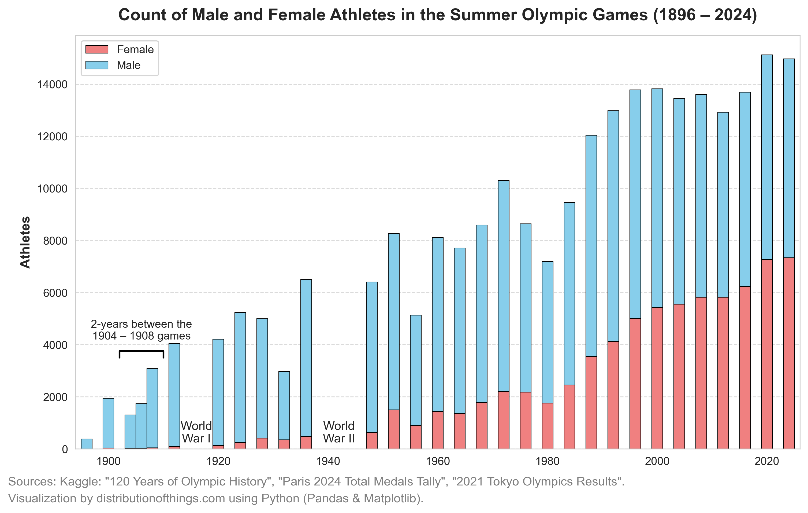
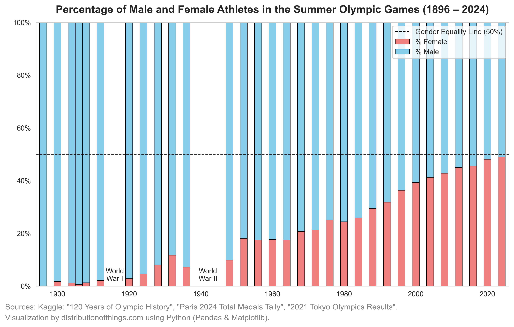

The Summer Olympic Games have undergone significant transformations since their inception in 1896. From the number of athletes to the inclusion of sports and the growing representation of female athletes, the evolution of the Games reflects broader societal changes, particularly in gender inclusion and athletic diversity.

## The evolution of sports

The variety of sports in the Olympic Games has expanded considerably. The chart below shows the growth in the number of disciplines since the Games began. Early Olympics featured a relatively small selection of traditional sports like athletics, wrestling, and cycling. Over time, new sports such as **badminton, triathlon, BMX cycling, and skateboarding** were introduced, reflecting changing global interests and athletic innovations.

The inclusion of extreme sports like **surfing, sport climbing, and skateboarding** marks a stark contrast to some of the more traditional—and in some cases, now obsolete—events like **art competitions**, which were part of the Olympic program between 1912 and 1948. These early events celebrated fine arts like painting, sculpture, architecture, and literature, reflecting the Olympic movement's initial aspiration to combine physical prowess with artistic achievement.

As the cultural landscape has shifted, the International Olympic Committee (IOC) has increasingly focused on keeping the Games exciting and relevant to younger generations, incorporating sports that are more closely tied to contemporary lifestyles and pop culture.

.png)

## Gender participation

The first modern Olympics in 1896 **excluded** female athletes entirely. Over time, women have increasingly become part of the Games, with participation surging especially in the latter half of the 20th century and into the 21st. The chart below highlights this shift. While the number of male athletes has grown consistently, the increase in female athletes has been much steeper, especially after the 1980s.

By the Tokyo 2020 Olympics and leading into the Paris 2024 Games, female participation approached near parity with male athletes. This trend is even more apparent in the **Percentage of Male and Female Athletes Over Time** chart, which shows that by 2024, women comprised close to 50% of all competitors—a significant milestone in gender equality in sports.

## Gender representation across sports

While the overall participation of women has increased, the availability of sports for both genders has been uneven. The Gender Participation Across Sports in the Summer Olympic Games (1896 – 2024) chart illustrates how certain sports like **athletics, swimming, and gymnastics** have long been accessible to both genders, while others like **boxing, weightlifting, and wrestling** saw much later inclusion for female athletes.

.png)

 The uneven representation highlights the historical barriers women faced in accessing specific sporting events, as well as how far we’ve come in promoting equality in athletic competition.
