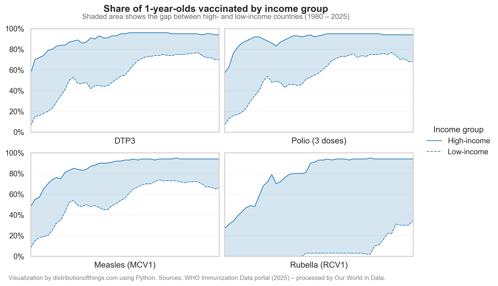

For centuries people attempted to prevent disease through variolation—deliberate exposure to infectious material. In 1796 Dr Edward Jenner demonstrated the first *vaccine* by using cowpox to protect against smallpox (the term *vaccine* comes from *vacca*, Latin for cow). Today the World Health Organization (WHO) lists more than two dozen diseases with licensed vaccines, most discovered in the 20th century. Research continues on additional *pipeline* vaccines.

### Smallpox: from mass disease to eradication

Smallpox is the clearest success of vaccination. The chart below shows reported global cases (1920–1985) falling to zero by the late 1970s as a result of the Intensified Eradication Programme (1967). The WHO certified global eradication in 1980. Building on this success, current agendas include polio eradication and the elimination of measles and rubella.

### Long-standing vaccine-preventable diseases

Deaths from diseases with vaccines available before 1980, including tuberculosis, measles, meningitis, typhoid, and tetanus, have declined since 1980. Reductions are largest for measles and tetanus, while tuberculosis remains the biggest contributor in absolute numbers, with the burden concentrated in low- and middle-income countries.

### Adoption and coverage

Adoption varies by product and setting. The heatmap shows the share of countries with each vaccine in their national immunization programme since 2000. Uptake expanded rapidly for Hib, hepatitis B, pneumococcal conjugate, rotavirus, and HPV. Other vaccines, such as varicella, hepatitis A, Japanese encephalitis, show slower or region-specific adoption, reflecting differences in disease risk, cost-effectiveness, supply, and delivery capacity.

.png)

Beyond adoption, coverage of essential vaccines recommended by WHO differs by income group. Coverage in high-income countries approaches 90–95% for core childhood vaccines. Low-income countries have made large gains from low levels in 1980, but coverage remains lower on average.

---

Notes: 
[1] Licensure vs. use. The timeline marks first licensure; widespread use typically follows after recommendations, financing, and supply are in place. 
[2] Adoption vs. coverage. Being in a national schedule does not imply universal coverage within countries; coverage depends on delivery and demand.

Sources: 
[1] [A brief history of vaccination](https://www.who.int/news-room/spotlight/history-of-vaccination/a-brief-history-of-vaccination) 
[2] [Immunization, vaccines and biologicals](https://www.who.int/teams/immunization-vaccines-and-biologicals/diseases)
