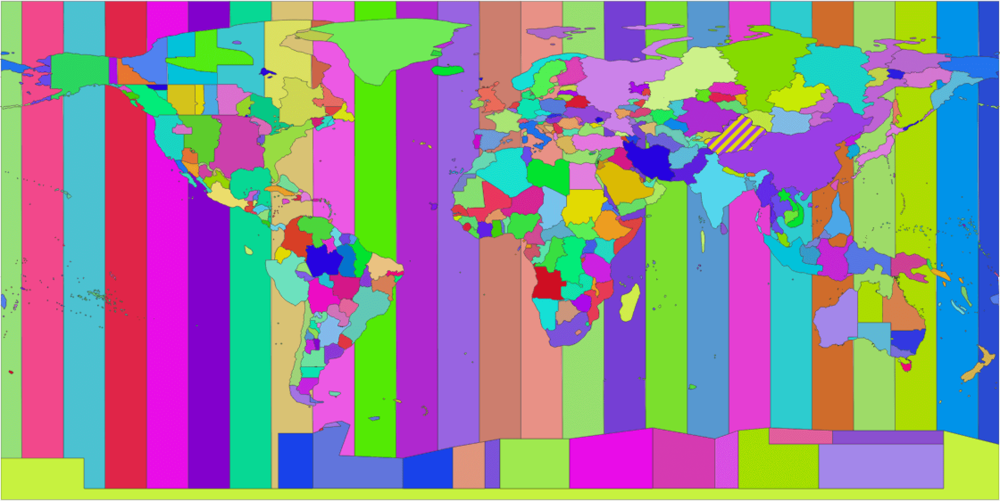
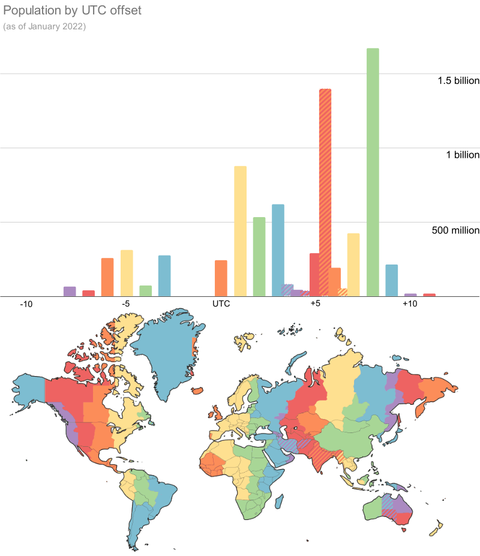

The other day I was surprised to read that close to 25 percent of the world’s population would enter 2022 at the same time.[1](#notes) That’s almost 2 billion people!

This got me thinking. How is the world population distributed across time zones? This was something I wanted to visualize with a bar chart and a map.

I looked up online to see if it had already been done and hoped to find a dataset that would allow me to easily plot such a distribution.

Well let me tell you it wasn’t easy!

First things first, what is a time zone?

Definitions vary, but a time zone is generally understood as a region where the same standard time is used. In other words it’s an area where people are expected to have their clocks in sync.

It can be further defined as an offset from Coordinated Universal Time (UTC), whether to use daylight saving time or not, and if so, when people should set their clocks forward and when they should set it back.[2](#notes)

The thing is, time zones are controlled by governments and, on a global scale, they change pretty frequently![3](#notes)

The tz database contains close to 400 different time zones, albeit many of which are historical! The maintainers of this collaborative project record regions of the world where local clocks have, since 1970, all been the same.[4](#notes)

Looking at this image for too long can cause seizures ©Evan Siroky ([source](https://github.com/evansiroky/timezone-boundary-builder))

Anyway, this is not what I had in mind when I started this… A graph with the number of people for each possible combination that makes up a time zone would likely be hideous (sorry if you made one and think it’s pretty. I’d love to see it…)

I just wanted to distribute the world population along a simple numerical variable. What I wanted to know is how many humans share the same local time, for each possible local time.

Well there’s a more accurate word for this and that word is _UTC offset._ I still kept the term “time zone” in the title of this article because I assume this is how most people would search for it and I would like them to find the article :)

There’s another catch: two zones might share the same local time right now but have different local times at some point during the year. Take South Africa and France for instance. South Africa is 2 hours ahead of UTC, all year round. France is 1 hour ahead of UTC between the last Sunday of October and last Sunday of March and 2 hours ahead of UTC the rest of the time, effectively sharing the same local time with South Africa approximately seven months of the year.

I decided to take the UTC offsets as of the 1st of January 2022 in order to be able to answer my initial question which was: **How many people moved into the new year together?**

Once this was clarified in my head I went out to look for a dataset of territories and their populations[5](#notes) and a dataset of territories and their UTC offsets.[6](#notes)

Join both tables and you’re done? Not quite…

There are some big countries out there and some of these big countries think it makes more sense to use different time zones. Fair enough. For these big multizone countries I had to manually gather the data in order to break down their population across the different local times currently in use.[7](#notes) I didn’t bother for locations with less than 10 million people as the impact would be virtually invisible on my chart.

Luckily I did not have to recreate a map as timeanddate.com maintains a pretty cool map that is automatically updated to show the offsets currently in use around the world.[8](#notes)

I pasted my chart above their map, tweaked the colors of the bars so they would match the regions of the world with the corresponding offset… et voilà!

I’ll let you appreciate the graph and spot the places where the biggest number of people entered 2022 at the same time (UTC +8). Based on my calculation (and datasets) it’s closer to 21% of the world’s population. Still impressive though.

As you can see there are some countries that think it’s cool to use a ½ hour offset. It’s not cool. It wasn’t for me at least. Anyway there are way too many people living in ½ hour offset places (hello India) for me to ignore them in my graph, so I created overlapping bars colored in a striped pattern.

But guess what? As if a ½ hour offset wasn’t precise enough, some places took it a level above with ¼ hour offsets! I excluded them. Sorry Nepal (30 million people), Chatham Islands (780 people) and Eucla (does anyone even live there?)…

Anyway, this painful process made me wonder: does it make sense to use time zones at all?

We’re so used to them that it’s hard to imagine a world without them. But couldn’t we all talk in UTC for instance?

Turns out I’m not the only one who thought about that. A bunch of people have called for the abolition of time zones[9](#notes)…

I suspect it’s mostly people who have had to deal with time zones during a project and found them frustrating. Plus a few who have missed a flight because of unclear booking tickets.

To be honest, I think I’m in favor of keeping them for now, but that might just be because I’m out of time...

  

* * *

**Notes and data sources**

1.  [↑](#cite-ref-1 "Jump up")[timeanddate.com/counters/new-year-trivia.html](https://www.timeanddate.com/counters/new-year-trivia.html)
2.  [↑](#cite-ref-2 "Jump up")[en.wikipedia.org/wiki/Time_zone](https://en.wikipedia.org/wiki/Time_zone)
3.  [↑](#cite-ref-3 "Jump up")[timeanddate.com/news/time](https://www.timeanddate.com/news/time)
4.  [↑](#cite-ref-4 "Jump up")[en.wikipedia.org/wiki/List\_of\_tz\_database\_time_zones](https://en.wikipedia.org/wiki/List_of_tz_database_time_zones)
5.  [↑](#cite-ref-5 "Jump up")[population.un.org/wpp/Download/Standard/CSV](https://population.un.org/wpp/Download/Standard/CSV/)
6.  [↑](#cite-ref-6 "Jump up")[timezonedb.com/download](https://timezonedb.com/download)
7.  [↑](#cite-ref-7 "Jump up")I had to go through this painful process for the United States of America, Indonesia, Brazil, Russia, Mexico, Democratic Republic of Congo, Ukraine, Canada, Australia and Kazakhstan.
8.  [↑](#cite-ref-8 "Jump up")[timeanddate.com/time/map/](https://www.timeanddate.com/time/map/)
9.  [↑](#cite-ref-9 "Jump up")[en.wikipedia.org/wiki/Abolition\_of\_time_zones](https://en.wikipedia.org/wiki/Abolition_of_time_zones)